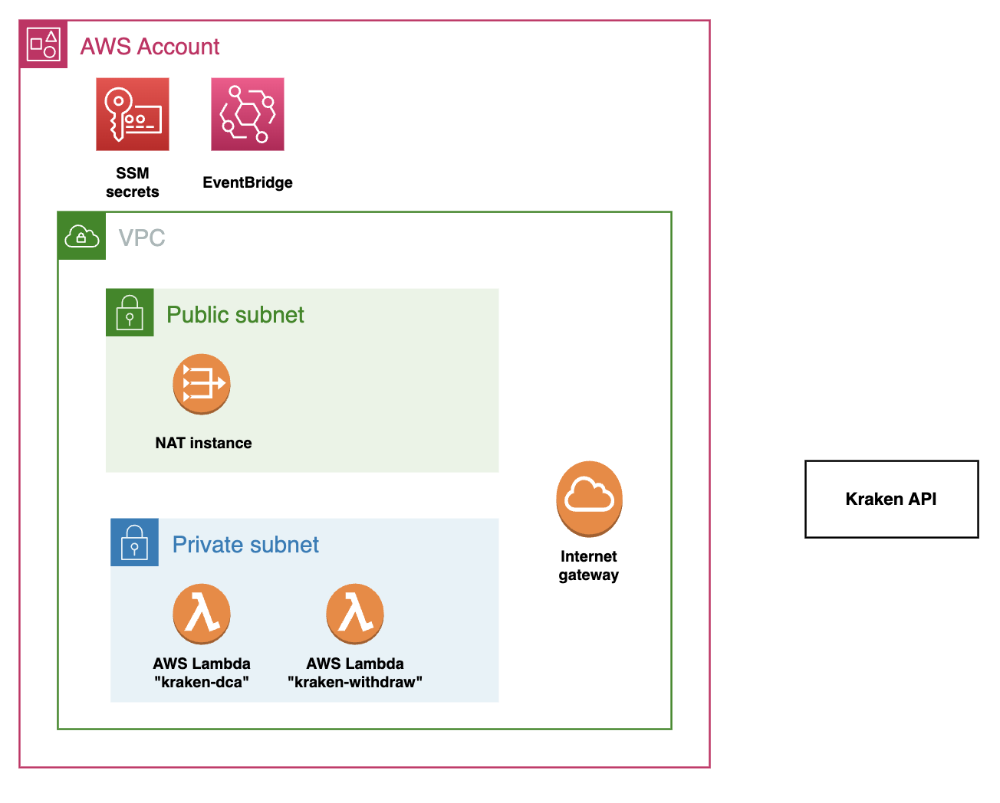

# Kraken-DCA
- Serverless application that automates recurring purchases of crypto on Kraken Exchange
  - Works for any cryptocurrency available on Kraken, and any desired purchase interval
- 90% reduction in trading fees as compared to using the built-in recurring purchase feature in the Kraken mobile app

## Purchasing script `dca.py`
- Use `GET https://api.kraken.com/0/public/Ticker?pair={trading_pair}` to get current market price of asset
- Use `POST https://api.kraken.com/0/private/AddOrder` to create limit order
  - Use limit orders because they have lower fees than market orders

## Withdrawal script `withdraw.py`
- Use `POST https://api.kraken.com/0/private/Balance` to see what current balance is
- Use `POST https://api.kraken.com/0/private/Withdraw` to withdraw the total balance to external wallet

## AWS Infrastructure
- AWS Lambda holds python script and dependencies
- AWS Eventbridge used to schedule Lambda function execution
- AWS SSM used to store API keys and purchase budget, accessed from Lambda function
- AWS S3 bucket used to store Terraform remote state (enables CI/CD pipeline)
- NAT Gateway has constant IP address (enables IP whitelisting for API keys)

